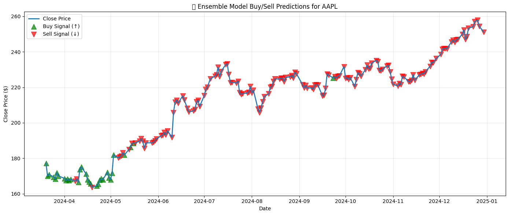

# 📈 Stock Trend Prediction with Technical Indicators and ML

([XGBoost_TimeSeriesCV_Buy_Sell_Predictions_For_AAPL.png])

This project aims to predict **next-day stock movement (Up/Down)** for Apple Inc. (`AAPL`) using technical indicators and machine learning. It features a clean pipeline for data acquisition, feature engineering, classification modeling, and evaluation with visual buy/sell signals.

---

## 🧠 Project Highlights

- ✅ Binary classification: **Will the stock close higher tomorrow?**
- 📊 Features: RSI, MACD, Bollinger Bands, EMA/SMA, and lag variables
- 🤖 Models: Logistic Regression, Random Forest, XGBoost, and an Ensemble Voting Classifier
- 🌀 Evaluation: Time Series Cross-Validation & Holdout Metrics
- 🧪 Visual Results: Buy/Sell signals plotted on historical stock charts

---

## 📂 Project Structure

```
📁 Stock_Trend_Prediction/
│
├── fetch_data.py                    # Fetch and preprocess AAPL data
├── model_training.py               # Train ensemble models on full dataset
├── model_training_timeseries.py    # XGBoost with TimeSeriesSplit CV
├── starter.ipynb                   # Notebook for EDA and experimentation
├── requirements.txt                # Python dependencies
│
├── Ensemble_Model_Buy_Sell_Predictions_For_AAPL.png
├── XGBoost_TimeSeriesCV_Buy_Sell_Predictions_For_AAPL.png
├── rf_feature_importances.png
├── XGBoost_Feature_Importance.png
├── Target Class Distribution.png
└── README.md
```

---

## ⚙️ Setup & Installation

```bash
# 1. Clone the repository
git clone https://github.com/Alpyaman/Stock_Trend_Prediction.git
cd Stock_Trend_Prediction

# 2. Create virtual environment
python -m venv venv
venv\Scripts\activate  # On Windows

# 3. Install dependencies
pip install -r requirements.txt
```

---

## 🔁 Workflow

### 1. Fetch & Engineer Data
- Uses `yfinance` to collect 2 years of AAPL stock data.
- Adds indicators:
  - EMA, SMA
  - RSI (14)
  - MACD + Signal Line
  - Bollinger Bands
  - Lagged features and calendar features (`DayOfWeek`, `Month`)

📄 Code: `fetch_data.py`

---

### 2. Train & Evaluate Ensemble Models

- Models used:
  - Logistic Regression (with scaling)
  - Random Forest Classifier
  - XGBoost Classifier
- Combined using **VotingClassifier (soft voting)**
- Visualizes Buy (↑) / Sell (↓) predictions on close price

📄 Code: `model_training.py`  
📈 Output:


---

### 3. Time Series Cross-Validation with XGBoost

- Uses `TimeSeriesSplit` for robust evaluation.
- Performs `GridSearchCV` to optimize XGBoost hyperparameters.
- Plots holdout predictions.

📄 Code: `model_training_timeseries.py`  
📈 Output:


---

## 📊 Visual Outputs

- Class distribution:
  
- XGBoost Feature Importance:
  
- Additional visuals in:
  - `Figure_2.png`
  - `starter.ipynb`

---

## 🔍 Dependencies

Install via `requirements.txt`. Major libraries:

- `yfinance`
- `pandas`, `numpy`
- `scikit-learn`
- `xgboost`
- `matplotlib`, `seaborn`

---

## 🧪 Evaluation Metrics

Each model is evaluated using:

- Confusion Matrix
- Precision, Recall, F1-score
- Visual Buy/Sell overlay on price history

---

## 📌 Future Enhancements

- Extend to multiple tickers (MSFT, TSLA, etc.)
- Add deep learning (LSTM)
- Include portfolio-level backtesting
- Streamlit dashboard for interactive predictions

---

## 📬 Contact

- **Author**: Alpyaman  
- **GitHub**: [@Alpyaman](https://github.com/Alpyaman)

---

## 📝 License

MIT License (see `LICENSE` file)
