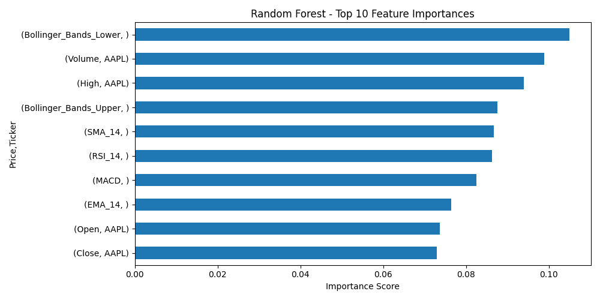
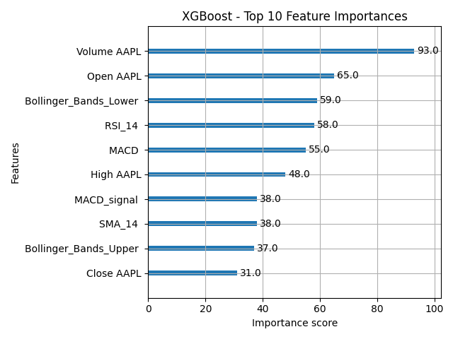

# 📈 Stock Trend Prediction with Technical Indicators and ML

This project predicts **next-day stock movement (Up/Down)** for Apple Inc. (`AAPL`) using technical indicators and machine learning. It features a **refactored, production-ready** codebase with proper module structure, type hints, error handling, and comprehensive logging.


---
 
## 🧠 Project Highlights
 
- ✅ Binary classification: **Will the stock close higher tomorrow?**
- 📊 Features: RSI, MACD, Bollinger Bands, EMA/SMA, and lag variables
- 🤖 Models: Logistic Regression, Random Forest, XGBoost, and an Ensemble Voting Classifier
- 🌀 Evaluation: Time Series Cross-Validation & Holdout Metrics
- 🧪 Visual Results: Buy/Sell signals plotted on historical stock charts
- 🏗️ **NEW**: Production-ready code with proper architecture and best practices
 
---
 
## 🆕 What's New in This Refactor
 
- **Modular Architecture**: Clean separation of concerns with dedicated modules
- **Type Hints**: Full type annotations for better IDE support and code clarity
- **Error Handling**: Comprehensive try-catch blocks and validation
- **Logging**: Professional logging infrastructure throughout
- **Configuration Management**: Centralized config with dataclass
- **No Code Duplication**: Single source of truth for all functions
- **Documentation**: Docstrings for all functions and classes
- **Better Dependencies**: Clean requirements.txt with proper versioning
- **Git Best Practices**: Proper .gitignore for Python projects
 
---
 
## 📂 Project Structure
 
```
📁 Stock_Trend_Prediction/
│
├── src/
│   └── stock_prediction/          # Main package
│       ├── __init__.py             # Package initialization
│       ├── config.py               # Configuration management
│       ├── data_fetcher.py         # Data acquisition with error handling
│       ├── feature_engineering.py  # Technical indicators & features
│       ├── models.py               # Model training & evaluation
│       └── utils.py                # Logging and utilities
│
├── scripts/
│   ├── explore_data.py             # ✨ Data exploration & visualization
│   ├── train_ensemble.py           # ✨ Train ensemble model
│   ├── train_xgboost_timeseries.py # ✨ XGBoost with TimeSeriesCV
│
├── starter.ipynb                   # Notebook for experimentation
├── requirements.txt                # Python dependencies (updated)
├── .gitignore                      # Git ignore rules
│
└── output/                         # Generated plots and results
    ├── Ensemble_Model_Buy_Sell_Predictions_For_AAPL.png
    ├── XGBoost_TimeSeriesCV_Buy_Sell_Predictions_For_AAPL.png
    ├── rf_feature_importances.png
    ├── XGBoost_Feature_Importance.png
    └── Target Class Distribution.png
```

---

## ⚙️ Setup & Installation

```bash
# 1. Clone the repository
git clone https://github.com/Alpyaman/Stock_Trend_Prediction.git
cd Stock_Trend_Prediction

# 2. Create virtual environment
python -m venv venv
venv\Scripts\activate  # On Windows

# 3. Install dependencies
pip install -r requirements.txt
```

---

## 🔁 Workflow

### 1. Explore Data
Fetch stock data, add technical indicators, and generate visualizations:
 
```bash
python scripts/explore_data.py
```
 
**Features added:**
- EMA, SMA (14-day)
- RSI (14-day)
- MACD + Signal Line + Histogram
- Bollinger Bands (20-day)
- Lagged features (`Close_t-1`, `RSI_14_t-1`)
- Calendar features (`DayOfWeek`, `Month`)
 
**Outputs:**
- Class distribution plot
- Feature correlation analysis
- Technical indicators visualization
 
---
 
### 2. Train Ensemble Model
 
Train a voting classifier with Logistic Regression, Random Forest, and XGBoost:
 
```bash
python scripts/train_ensemble.py
```
 
**Features:**
- Logistic Regression (with StandardScaler)
- Random Forest Classifier
- XGBoost Classifier (no deprecated parameters)
- Soft voting ensemble
- Feature importance plots
 
📈 **Output:**

 
---
 
### 3. Train with Time Series Cross-Validation
 
Optimize XGBoost hyperparameters using GridSearchCV with TimeSeriesSplit:
 
```bash
python scripts/train_xgboost_timeseries.py
```
 
**Features:**
- `TimeSeriesSplit` for proper time series validation
- `GridSearchCV` for hyperparameter tuning
- Comprehensive logging
- Feature importance analysis
 
📈 **Output:**


---

## 📊 Visual Outputs

- Class distribution:
  
- XGBoost Feature Importance:
  
- Additional visuals in:
  - 
  - `starter.ipynb`

---

## 🔍 Dependencies
Updated `requirements.txt` with proper versioning:
 
```
# Data manipulation and analysis
numpy>=1.24.0
pandas>=2.0.0
 
# Data fetching
yfinance>=0.2.0
 
# Machine Learning
scikit-learn>=1.3.0
xgboost>=2.0.0
 
# Visualization
matplotlib>=3.7.0
seaborn>=0.12.0
```
 
---
 
## 💻 Using the Package Programmatically
 
You can also import and use the package in your own scripts:
 
```python
from stock_prediction import Config, DataFetcher, FeatureEngineer, ModelTrainer
from stock_prediction.utils import setup_logging
 
# Setup logging
logger = setup_logging(level="INFO")
 
# Configure for a different ticker
config = Config(ticker="MSFT", start_date="2023-01-01", end_date="2024-01-01")
 
# Fetch and prepare data
fetcher = DataFetcher(config)
df = fetcher.fetch_data()
 
engineer = FeatureEngineer(config)
df = engineer.prepare_features(df, include_target=True)
 
# Train models
trainer = ModelTrainer(config)
# ... your training code
```
 
---
 
## 🧪 Evaluation Metrics
 
Each model is evaluated using:
 
- **Confusion Matrix**: True positives, false positives, etc.
- **Classification Report**: Precision, Recall, F1-score
- **Visual Analysis**: Buy/Sell signals overlaid on price charts
- **Feature Importance**: Understanding which indicators drive predictions
 
---
 
## 🚀 Latest Improvements (NEW!)
 
### Accuracy Enhancement Features ✅
 
I've implemented comprehensive accuracy improvements.
 
**New Features**:
- ✅ **Advanced Technical Indicators**: Stochastic, ADX, CCI, Williams %R, Ichimoku Cloud, MFI
- ✅ **Intelligent Feature Selection**: Mutual information + correlation filtering
- ✅ **SMOTE**: Better class imbalance handling
- ✅ **Model Stacking**: Meta-learner ensemble (better than voting)
- ✅ **Walk-Forward Validation**: Realistic time series evaluation
- ✅ **Comprehensive Training Script**: `train_improved.py` with all enhancements
 
**Expected Improvements**: 15-30% better F1-score through:
- Richer feature set (16+ technical indicators)
- Noise reduction (feature selection)
- Better minority class handling (SMOTE)
- Optimized ensemble learning (stacking)
 
### Quick Start with Improvements:
```bash
python train_improved.py
```
 
---
 
## 📌 Future Enhancements
 
- [ ] Extend to multiple tickers (MSFT, TSLA, GOOGL, etc.)
- [ ] Add deep learning models (LSTM, GRU, Transformers)
- [ ] Portfolio-level backtesting with transaction costs
- [ ] Streamlit dashboard for interactive predictions
- [ ] Real-time prediction API
- [ ] Sentiment analysis from news/social media
- [ ] Unit tests and CI/CD pipeline
- [ ] Automated hyperparameter optimization (Optuna)

---

## 📬 Contact

- **Author**: Alpyaman  
- **GitHub**: [@Alpyaman](https://github.com/Alpyaman)

---

## 📝 License

MIT License (see `LICENSE` file)
